# SQL Murder Mystery

**Actividad:** SQL Murder Mystery  

**Detective** Laura Vanessa Botero Gil

---

## Resumen de la investigación

Tras la perdida del informe inicial del asesinato y lograr recuperar este se logro contactar a los dos testigos mencionados, **Morty Schapiro** y **Annabel Miller**, los cuales brindaron pistas adicionales al caso, las cuales tras seguirse exhaustivamente a traves de diferentes busquedas, nos permitió llegar al asesino **Jeremy Bowers**, identificado principalmente por su carro y membresia de gimnasio,al revisar la entrevista del asesino, informó que  fue contratado para cometer el crimen, por lo cual inició una nueva busqueda de la mente intelectual tras el asesinato **Miranda Priestly**.

---

## Bitácora de Investigación

La investigación inició con la información que se tenía un asesinato ocurrido en SQL City el día 15 de enero del 2018. A partir de ahí, cada consulta brindó información adicional, desde los testimonios de los testigos hasta la identidad de la mente intelectual detrás del homicidio.

---

### Paso 1 — Encontrar el reporte de la escena del crimen
```sql
SELECT * FROM crime_scene_report 
WHERE type = 'murder' 
AND city = 'SQL City';
```

**Buscaba** Encontrar el recorte del crimen ocurrido en SQL City para tener información del caso 
**Descubri** Existia un unico asesinato para la fecha en la ciudad.El reporte mencionaba a dos terstigos y la forma en la cual se podían encontrar, pues uno vivía en el ultimo numero de la calla Northwestern Dr, y la otra se llamaba Annabel y vivia en Franklin Ave.

---

### Paso 2 — Identificar al primer testigo (Northwestern Dr)
```sql
SELECT DISTINCT name, address_number
FROM person 
WHERE address_street_name LIKE 'Northwestern Dr' 
ORDER BY address_number DESC 
LIMIT 5;
```

**Buscaba** Encontrar el nombre del testigo que vivía en el número mencionado de Northwestern Dr.  
**Descubrí** Se encontro que el testigo era **Morty Schapiro**, quien vive en el ultimo numero  de esa calle.

---

### Paso 3 — Identificar a la segunda testigo 
```sql
SELECT DISTINCT *
FROM person 
WHERE address_street_name LIKE 'Franklin Ave' AND name LIKE '%Anna%';
```

**Buscaba** Encontrar todos los datos de la testigo llamada Annabel que vive en Franklin Ave. 
**Descubrí** Los datos completos de la  testigo **Annabel Miller**, para consultar su testimonio.

---

### Paso 4 — Leer los testimonios de ambos testigos
```sql
SELECT p.name, i.transcript, p.id
FROM person AS p 
JOIN interview AS i
  ON i.person_id = p.id
WHERE name LIKE 'Morty Schapiro' OR name LIKE 'Annabel Miller';
```

**Buscaba** Conocer las declaraciones de los testigos para obtener pistas sobre el caso, inicialmente pensé que alguno podía ser un farsante,pero al revisar las declaraciones ambas coincidian con otra persona

**Descubrí**  
- **Annabel Miller** vio al asesino en el gimnasio *Get Fit Now* el **9 de enero de 2018**, y su membresía empieza con `48Z`.  
- **Morty Schapiro** vio al sospechoso huir en un carro cuya placa contenía `H42W`, y era un miembro Gold del gimnasio.

---

### Paso 5 — Buscar miembros del gimnasio con membresía `48Z` y check-in el 9 de enero
```sql
SELECT a.membership_id, m.person_id, m.name, a.check_in_date
FROM get_fit_now_member AS m
JOIN get_fit_now_check_in AS a
  ON m.id = a.membership_id
WHERE membership_id LIKE '%48Z%' AND check_in_date = 20180109;
```

**Buscaba** Filtrar los miembros que coincidian con los fragmentos de la membresia del gimnasio que se conocian que hicieron check-in el día señalado por Annabel.  
**Descubrí** Había dos posibles sospechosos con membresía que empieza en `48Z`, por lo cual realicé la validación con la placa del carro.

---

### Paso 6 — Cruzar la placa del carro `H42W` con los sospechosos
```sql
SELECT p.name, d.plate_number
FROM person AS p
JOIN drivers_license AS d
  ON p.license_id = d.id
WHERE plate_number LIKE '%H42W%';
```

**Buscaba** Confirmar si alguno de los sospechosos tenía una placa que contenía `H42W`, tal como describió Morty Schapiro.  
**Descubrí** **Jeremy Bowers** coincide con ambos testimonios: membresía Gold en el gimnasio con check-in el 9 de enero **y** placa con `H42W`. Por lo cual se define que era el asesino.

---

### Paso 7 — Leer el testimonio de Jeremy Bowers
```sql
SELECT p.id, p.name, i.transcript
FROM person AS p
JOIN interview AS i
  ON i.person_id = p.id
WHERE name LIKE 'Jeremy Bowers';
```

**Buscaba** Obtener la declaración del asesino para conocer los hechos.  
**Descubrí** Jeremy Bowers fue **contratado** por una mujer: cabello rojo, entre 65 y 67 pulgadas de altura, que conducía un Tesla, y asistió al *SQL Symphony Concert* en diciembre de 2017 **tres veces**, por lo cual procedí a buscarla.

---

### Paso 8 — Buscar mujeres con las características físicas del cómplice
```sql
SELECT p.name, p.id, d.car_model, d.car_make
FROM drivers_license AS d
JOIN person AS p
  ON d.id = p.license_id
WHERE d.hair_color LIKE 'red' 
  AND d.height BETWEEN 65 AND 67 
  AND gender LIKE 'female' 
  AND car_make = 'Tesla';
```

**Buscaba** Identificar mujeres en la base de datos que coincidan con la descripción física dada por Jeremy Bowers.  
**Descubrí** Tres posibles sospechosas: **Red Korb**, **Regina George** y **Miranda Priestly**. Por lo cual pasé a verificar la asistencia al evento.

---

### Paso 9 — Verificar asistencia al SQL Symphony Concert
```sql
SELECT p.name, e.event_name, e.date
FROM person AS p
JOIN facebook_event_checkin AS e
  ON p.id = e.person_id
WHERE name IN ('Red Korb', 'Regina George', 'Miranda Priestly');
```

**Buscaba** Confirmar cuál de las tres candidatas asistió al *SQL Symphony Concert* en diciembre de 2017, exactamente tres veces.  
**Descubrí** Únicamente **Miranda Priestly** aparece registrada en el evento las tres veces mencionadas por Jeremy Bowers, dejandola en evidencia como la **mente maestra del asesinato**.

---

## Evidencias

### Reporte del crimen 
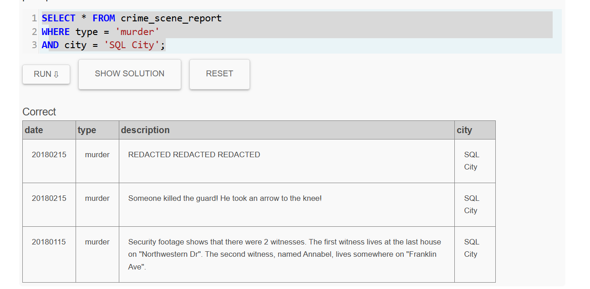

### Busqueda testigo 01
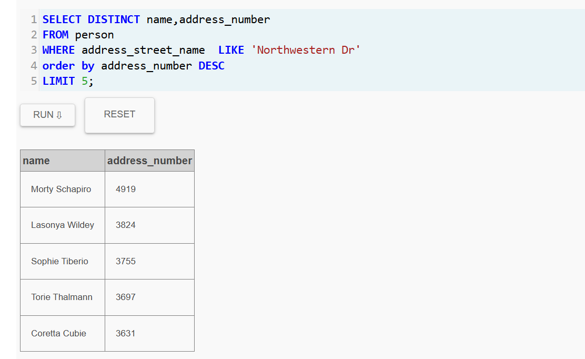

### Busqueda testigo 02
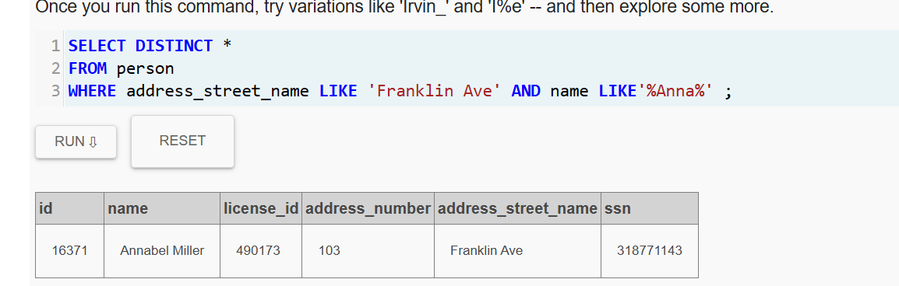

### Testimonios
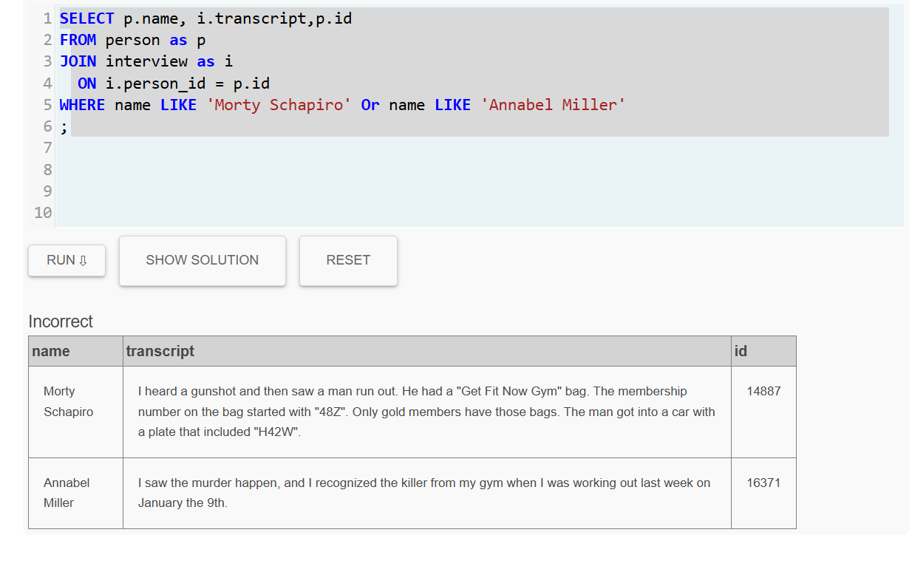

### Busqueda Sospechoso
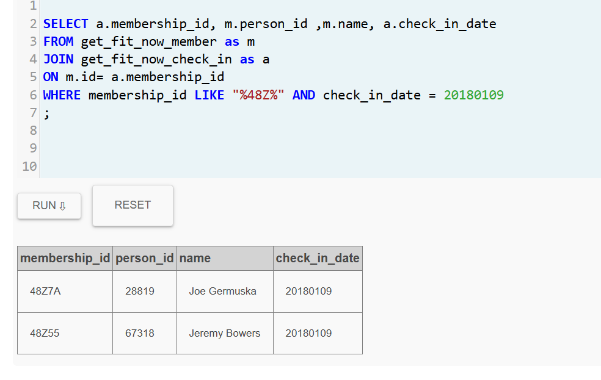
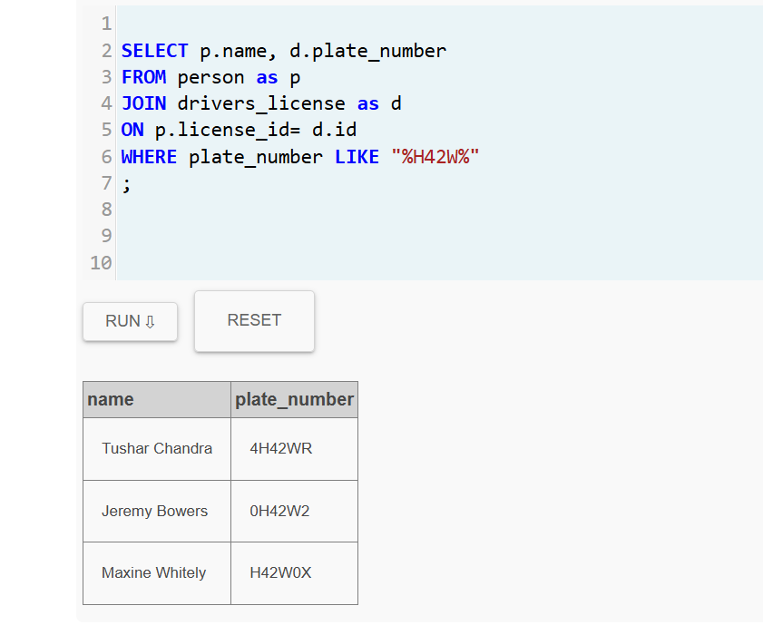

### Testimonio de Jeremy Bowers
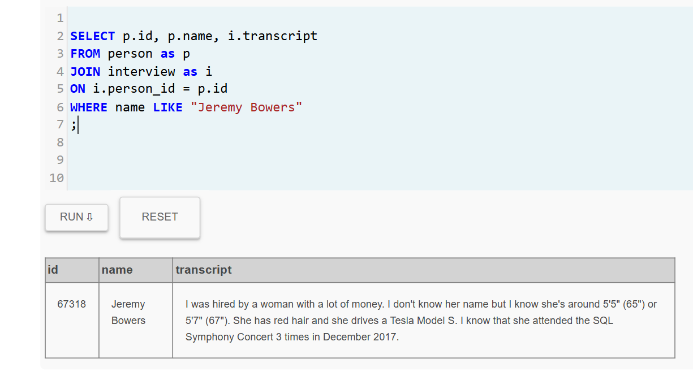

### Busqueda mente maestra
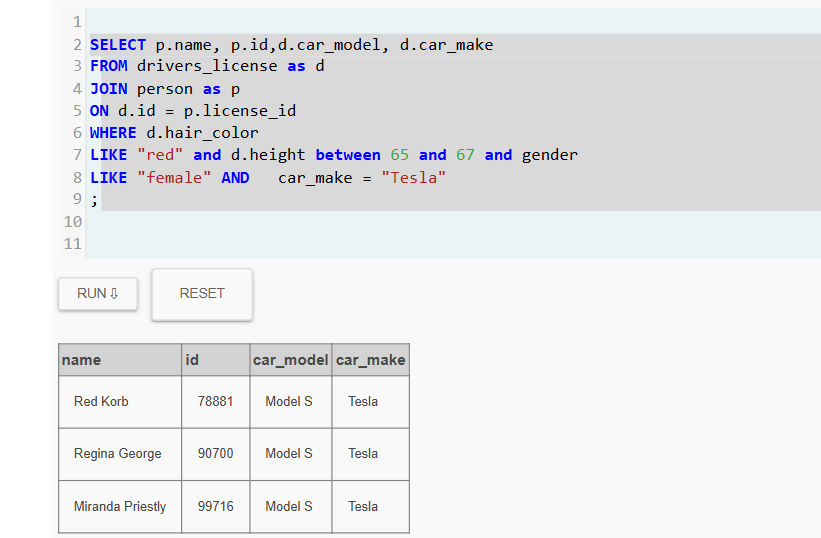
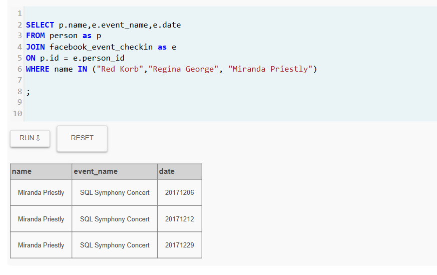


### Mensaje de la plataforma al finalizar busquedas
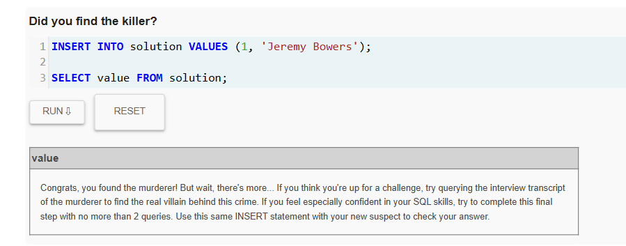
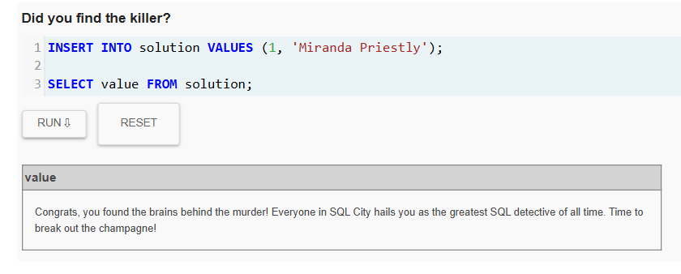

---

##  Conclusión

| Rol | Persona |
|---|---|
| **Asesino** | Jeremy Bowers |
| **Mente intelectual**| Miranda Priestly |
